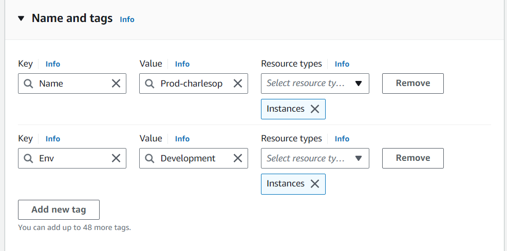

# Cloud-Security-with-AWS-IAM
- Cloud security is critical when working with AWS, and Identity and Access Management (IAM) is one of the foundational services for controlling who can access AWS resources
- AWS IAM provides fine-grained control over permissions and access to ensure that users, groups, and services have only the necessary rights, adhering to the principle of least privilege

## Key concepts
- IAM Users:a person or application that needs access to AWS services, Users can be assigned policies that define what AWS resources they can access and what actions they can perform
- IAM Roles:are similar to users but do not have long-term credentials associated with them 
- IAM Policies:Policies are JSON documents that define permissions and access to resources,policies can be Managed or Inline policies.
- IAM Groups:Groups simplify user management by allowing you to assign policies to a group of users at once

## Using AWS EC2 and IAM for Cloud Security 
- To demonstrate cloud security using AWS EC2 and IAM, we’ll go through a scenario where we:
1. Launch an EC2 instance and assign appropriate permissions.
2. Use IAM roles to secure access for the EC2 instance.
3. Control access to the instance via security groups and SSH keys.
4. Secure access to AWS resources (like S3) for the EC2 instance using IAM roles instead of static credentials.

## Case Scenario :I will set up two EC2 instances to test the effectiveness of permission settings ,setting up AWS IAM and using tags to label them
## Diagrams

## Steps
- Log into your AWS user account and navigate to EC2(use the region closer to you/users)
- Click on Launch Instance and choose Launch Instance from the drop-down(the EC2 name should be unique in that region)
- Add tags;these are key-value pairs that you can use to organize, manage, and categorize your AWS resources
- Select an AMI that meets your needs (e.g., Amazon Linux 2, Ubuntu, Windows, etc)

